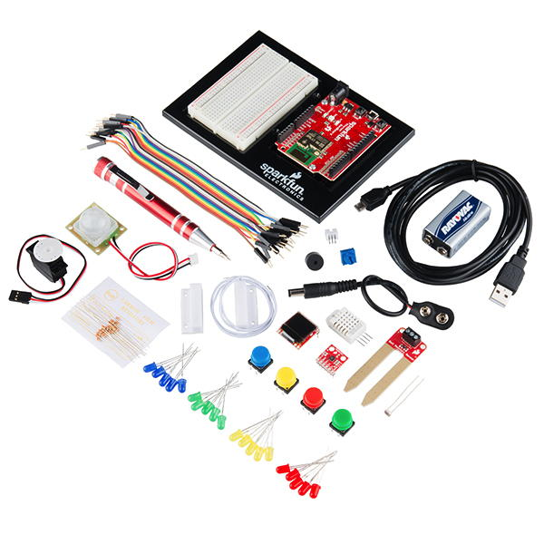

# Project Introduction

[Prerequisite Knowledge recommended for this IoT project](https://docs.idew.org/code-internet-of-things/prerequisite-knowledge)



## What is the Internet of Things?

A growing trend in computing is the “**Internet of Things**” \(abbreviated as: **IoT**\) – devices connected to the internet \(and/or to other devices\) which interact with the physical world by gathering, processing, and sharing data. IoT devices are also referred to as **connected devices** or as **smart devices**.

This project is tailored for an IoT electronics kit called the [SparkFun Inventor's Kit for Photon](https://www.sparkfun.com/products/13320). SparkFun also sells a variety of other sensors and components that can be used with the Photon kit. For example, it is highly recommended to add an [ultrasonic sensor](https://docs.idew.org/code-internet-of-things/references/physical-inputs/ultrasonic-sensor) to the kit for more design possibilities.

**However, you may use another IoT electronics kit of your choice for this project**. If the IoT kit is programmed using Arduino or Wiring, then you might be able to use \(or modify\) the existing tutorials and references in the accompanying IoT Code Guidebook \(depending on the particular components and capabilities of your IoT electronics kit\).  

## Examples of IoT Devices

Many different IoT devices are becoming developed for consumers, businesses, industry, agriculture, healthcare, and the public sector. A few examples include:

* Wearable devices that monitor people’s health and fitness
* Smart thermostats that keep homes comfortable while also saving energy
* Connected street lights that adjust based on time of day, season, and weather conditions
* Smart farming systems that monitor precise weather, soil, and crop conditions
* etc.

## Characteristics of IoT Devices

Similar to robotic devices, IoT devices follow a "sense-think-act" cycle to interact with the physical world. IoT devices also "communicate" through an internet or network connection.

* **SENSE:**  IoT devices typically have one or more **physical inputs** \(such as sensors, etc.\) that gather data from the physical environment.
* **THINK:**  IoT devices are programmed to analyze data from their inputs to make decisions and respond to certain conditions by acting through their outputs.
* **ACT:**  IoT devices typically have one or more **physical outputs** \(such as motors, etc.\) that can do something in the physical environment.
* **COMMUNICATE:**  IoT devices send and/or receive data by communicating with other apps, databases, or other devices through an **internet or network connection** \(which is often a wireless signal such as cellular, Wi-Fi, Bluetooth, etc.\). This data communication can serve as a digital input \("sense"\) or as a digital output \("act"\).

## What made IoT possible?

The “Internet of Things” is the result of advances in technology and manufacturing that have made it feasible to incorporate computing and networking features into almost any device:

1. **Computing parts** \(such as processors, sensors, batteries, etc.\) have become much smaller, more powerful, more energy-efficient, and more affordable.
2. **Wireless networking** \(such as cellular, Wi-Fi, Bluetooth, etc.\) has become much faster, more energy-efficient, and more widespread. While IoT devices can use a wired network connection \(such as Ethernet\), a wireless connection makes it much easier for devices to connect to the internet or another network.



In this project, students will collaborate in small teams to design, develop, and evaluate their own technology solutions to an authentic challenge. Teams will follow a user-centered design approach which focuses on understanding the goals, needs, expectations, and experiences of the people that will use their technology solution. Evaluation and testing of ideas and prototypes is integrated throughout the design and development process.

This project is designed to follow the research-based “Gold Standard” model of Project Based Learning \(PBL\) developed by the [Buck Institute of Education](http://www.bie.org/about/what_pbl).

This project is intended to be completed throughout a semester-long high school CS course. Here are the estimated times required to complete each project phase:

| **Project Phase** | **Estimated Time** |
| :--- | :--- |
| 1 Discover & Define Problem | 6-7 weeks |
| 2 Design & Build Solution | 5-7 weeks |
| 3 Evaluate & Refine Solution | 2-3 weeks |
| 4 Share Project with Public | 1-2 weeks |

### Assignment Templates 

Some of the project assignments include links to Google Drive templates \(document, spreadsheet, slide presentation, drawing, etc.\). All the templates are shared as "**View Only**." Students must create a **copy** of the template in order to modify it. \(Students should **not** request edit access, as the file is a master template for all students.\)


**MAKE A COPY:** To use a template, be sure you're logged in to your Google Account. From the **File** menu of the template, select **Make a copy**. Save the copy to your shared team folder in Google Drive. The copied file can now be modified.




This project reflects authentic principles and practices currently used in the technology industry. This project emphasizes design thinking, computational thinking, and 21st century success skills \(such as creative thinking, critical thinking, communication, and collaboration\).



It is recommended that each student also complete one or more [research reports](https://docs.idew.org/research-topics-in-computing/) in parallel to this project. These research reports should be shared with the class \(and beyond\).



Copyright © 2016-2019 Michael Frontz and Jim Lyst, Indiana University School of Informatics and Computing at IUPUI

Part of the [Computing by Design](https://cxd.gitbooks.io/the-cxd-framework/) high school curriculum developed for the [Informatics Diversity-Enhanced Workforce \(iDEW\) Program](http://soic.iupui.edu/idew/)

This work is licensed under a [Creative Commons Attribution-NonCommercial-ShareAlike 4.0 International License](http://creativecommons.org/licenses/by-nc-sa/4.0/). You are free to use, share, or adapt this material for noncommercial purposes as long as you provide proper attribution and distribute any copies or adaptations under this same license.

