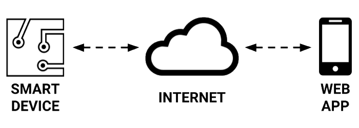

# Project Background and Challenge


**UPDATE IN PROGRESS:** This project guidebook is undergoing a major update to replace the [old version](https://docs.idew.org/internet-of-things-project/). Please check back later.  _Notice posted: June 5, 2018_


### Project Background

More info to come.

### Project Challenge

More info to come.

### Project Deliverables

* **Smart Device** that is built and programmed to be a functional prototype of your solution design
* **Web App** that interacts with your smart device by sending and/or receiving data through Internet
* **Product Website** that explains your solution and includes a product demo video
* **Project Poster** that shows how your solution was created and highlights key features of its design
* **Public Presentation** that demonstrates your solution and explains how it was created

### Project Criteria

* **Innovative:** your solution should be unique \(or be an improvement over existing solutions\)
* **Feasible:** your solution should be possible to prototype with the given resources
* **Useful:** your solution should fulfill a need, solve a problem, or improve an existing situation
* **Usable:** your solution should be easy to understand and efficient to use
* **Valuable:** your solution should be desirable and valuable to users/stakeholders

### Project Constraints

* Smart device prototype built using sensors and other parts in provided IoT electronics kit​
* Smart device prototype can include constructed parts \(e.g., cardboard, 3D-printing, etc.\)
* Smart device prototype may have to be a smaller-scale model of actual product
* Smart device prototype may have to simulate certain parts or actions for purposes of demo

