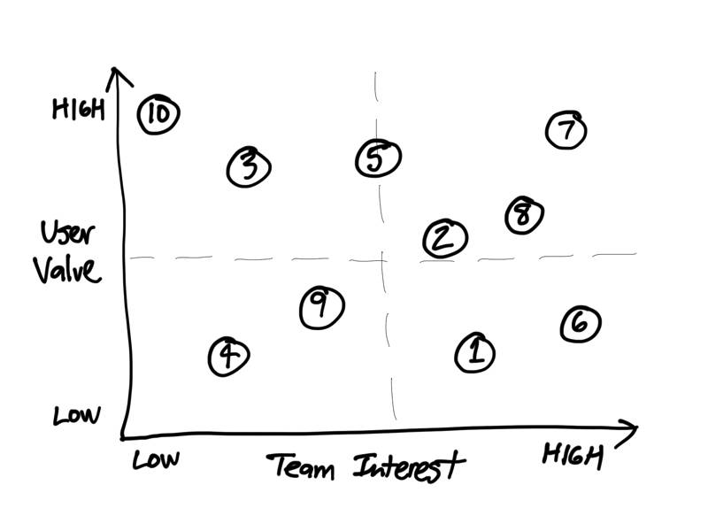

# 1.3 Project Ideas



Your team will generate possible ideas for a smart device that performs a useful and valuable task. After evaluating the ideas, your team will select one concept for your team’s project.


**RECOMMENDATION:** Focus on quantity of ideas before evaluating them for quality. Start your brainstorming by thinking of possible ways to use each part, as well as possible ways to combine different parts to perform some kind of task. For example, how many different ways can you think of to use a light sensor? What other inputs or outputs could be combined with a light sensor to help perform some kind of task? 


1. Each team member should independently generate and record at least 10 possible ideas for tasks that could be performed using one or more parts in the IoT electronics kit. If helpful, create quick sketches to help illustrate ideas.
2. As a team, discuss and refine your ideas to form a combined **numbered list** of possible tasks for smart devices. For each idea, discuss these questions and make any refinements:
   1. Does the smart device perform a useful task in an innovative way?
   2. What inputs and outputs from the IoT kit would be used to help perform the task? \(The smart device must use at least one input and at least one output from the IoT kit.\)
   3. Are there certain parts or actions of the smart device that would need to be simulated? If so, can you still create a prototype device that performs the main task?
   4. What are some possible ways that the smart device could interact with a web app?
3. Construct a [decision matrix](https://www.nngroup.com/articles/prioritization-matrices/) to help evaluate your team’s list of ideas by ranking the relative weight \(from Low to High\) of each smart device idea on these two criteria \(and then plotting a **numbered point** on the matrix to represent each concept\):
   1. **User Value** \(how desirable and valuable would this product likely be to users\)
   2. **Team Interest** \(how much interest do you have in pursuing this as your project\)
4. Use the decision matrix to select one concept to pursue for your team’s project. Ideally, your selected concept will have high user value and high team interest.

### **❏ Deliverable**

Submit each team member’s initial list of ideas, your team’s numbered list of ideas, your team’s decision matrix, and identify the concept in your list selected for your team’s project.







| **✓- Below Standard** | **✓ Meets Standard** | **✓+ Exceeds Standard** |
| :--- | :--- | :--- |
| Description | Description | Description |



