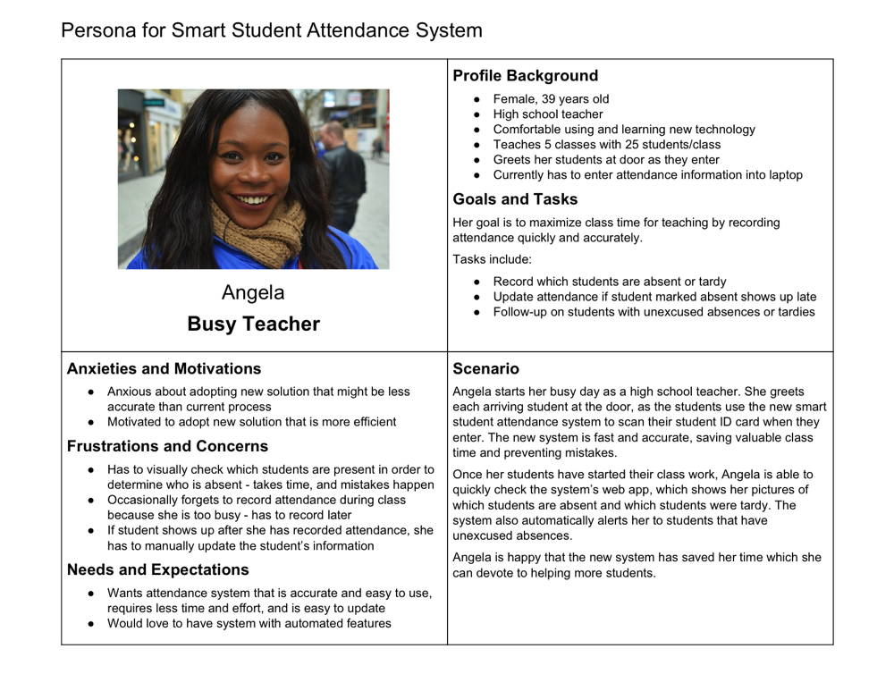

# 1.4 User Research



Conduct user research by interviewing potential users \(or other stakeholders\) for your smart device and web app. Analyze this user research data to create a persona and scenario of a typical user, which will help inform and guide your design process.

[Persona - Instructions](https://docs.idew.org/principles-and-practices/practices/design-practices/personas)

[Persona Template](https://drive.google.com/open?id=1osCQyHANhkd-mhSi3pqS-eDHLCoJ6HWfLkiK4UPMOkI)

### **❏ Deliverable**

Submit your team's interview questions, interview data, and persona.








| **✓- Below Standard** | **✓ Meets Standard** | **✓+ Exceeds Standard** |
| --- | --- |
| Description | Description | Description |



