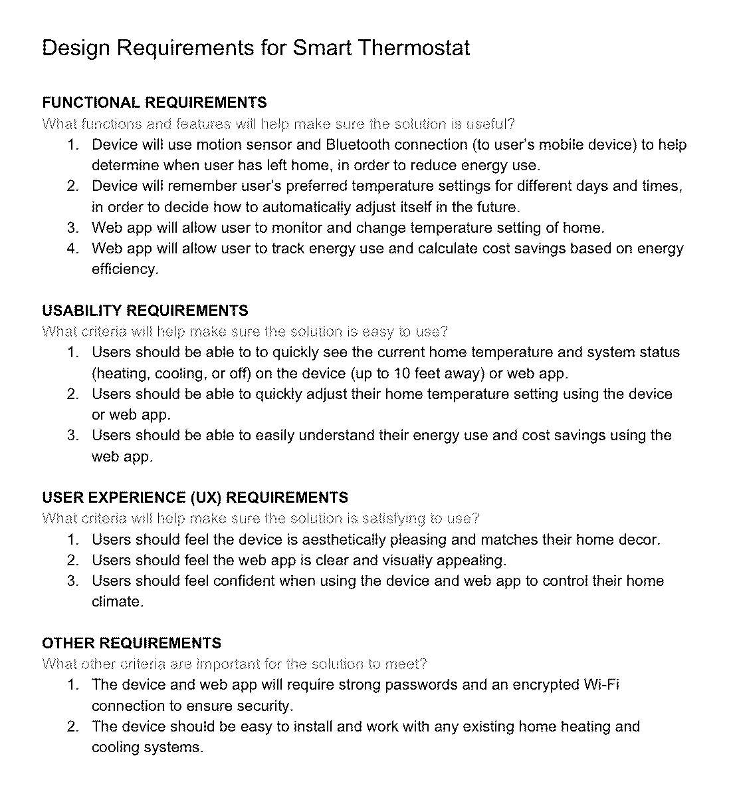

# 1.7 Design Requirements



Discuss and establish a list of [design requirements](https://docs.idew.org/principles-and-practices/practices/design-practices/design-requirements) that your team’s smart device and web app will have to meet. Your team's design requirements should list a minimum of:

* 3 Functional Requirements
* 3 Usability Requirements
* 3 User Experience \(UX\) Requirements
* 1 Other Requirement

[Design Requirements Template](https://drive.google.com/open?id=1s90kNoqE8tlwiD8g6EMzBsmf9aAJUIFmllBKfHcyf7c)

### **❏ Deliverable**

Submit a document with your team's design requirements








| **✓- Below Standard** | **✓ Meets Standard** | **✓+ Exceeds Standard** |
| :--- | :--- | :--- |
| Design requirements are incomplete, unclear, not measurable, or not helpful for designing solution. | Design requirements are clear, complete, and measurable. Requirements are informed by team's previous research and ideation. Requirements provide useful guidance for designing effective solution. | Requirements provide particularly insightful guidance for designing a valuable solution. |



