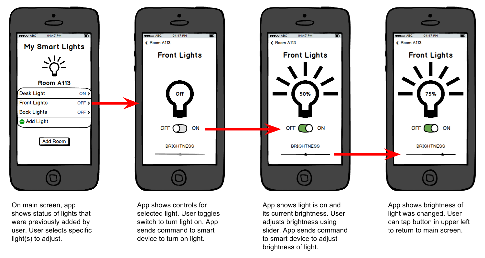

# 1.8 Interaction Storyboard



Create an [interaction storyboard](https://docs.idew.org/principles-and-practices/practices/design-practices/interaction-storyboards) with a sequence of 3-6 sketched screen mockups to show how a user would interact with your smart device’s web app to perform a task.


**REMINDER:** As you decide what tasks your web app could perform, remember there are 3 ways your web app can interact with your smart device through [Particle Cloud](https://docs.idew.org/code-internet-of-things/references/particle-cloud):

* web app can read and display data from smart device
* web app can send command \(with optional data\) to smart device
* web app can receive notifications from smart device


[Sketch Templates for Phone, Tablet, and Desktop](https://drive.google.com/open?id=1Xq2I690nLybxSX_k1b0SKzcH40PCmbY3)

### **❏ Deliverable**

Submit an image \(photo, scan, etc.\) of your team's interaction storyboard.








| **✓- Below Standard** | **✓ Meets Standard** | **✓+ Exceeds Standard** |
| --- | --- |
| Description | Description | Description |



