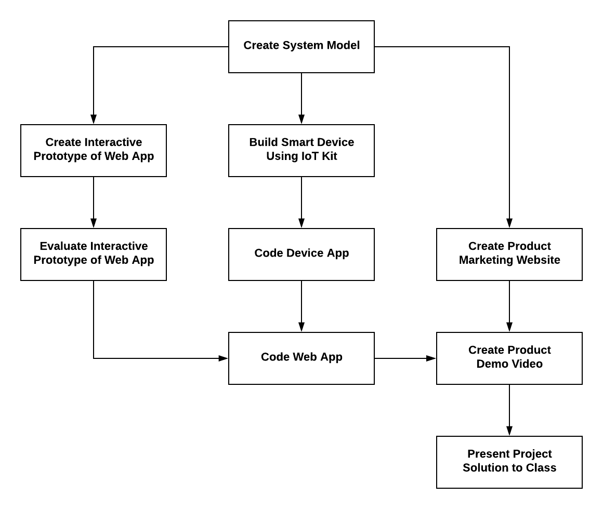
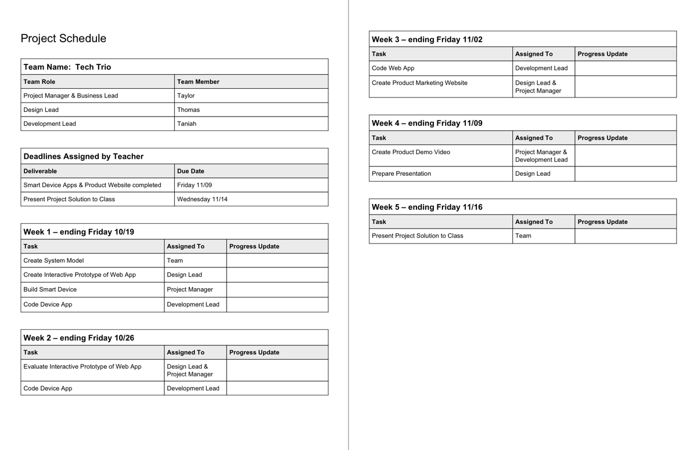

# 2.1 Project Schedule



IN PROGRESS

Your team needs to create a **project schedule** to help ensure that you'll complete all the necessary tasks involved to design and develop your team's smart device solution. This phase of the project will require about 4-6 weeks to complete. Your teacher will identify the specific deadline\(s\) for this project phase.

This flowchart shows the major tasks that your team must complete during this project phase:

In the first task, your team will work together to create a system model of your smart device and web app. This will give your team a shared vision of what your smart device solution will do.

Then your team members will start to work in parallel on different tasks, depending on their team role. Some of the tasks must be completed in a certain order. When necessary, you might have multiple team members working together on certain tasks.

Your team will finish this project phase by presenting your working smart device solution to the class. \(In the next project phase, your team will evaluate your solution with people outside your team, in order to refine the solution before the final public presentation.\)

### **❏ Deliverables**

* Submit your team's project schedule
* Provide weekly updates on your team's progress



Here's an example of a project schedule that breaks down the major task into weeks.

**NOTE:**  Your project schedule might use a different format that has more detailed information \(such as:  subtasks, estimated durations for tasks, start & end dates for tasks, etc.\).





| **✓- Below Standard** | **✓ Meets Standard** | **✓+ Exceeds Standard** |
| :--- | :--- | :--- |
| Description | Description | Description |



