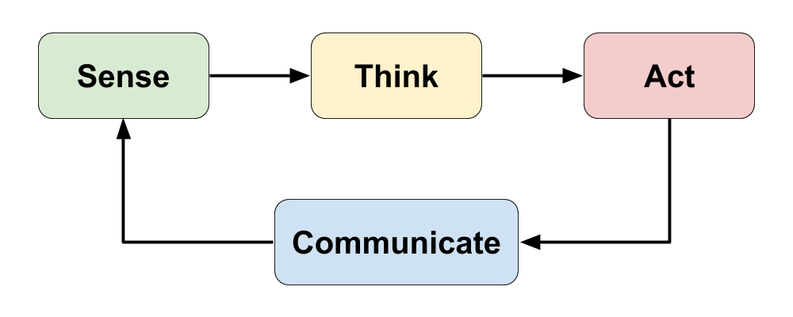
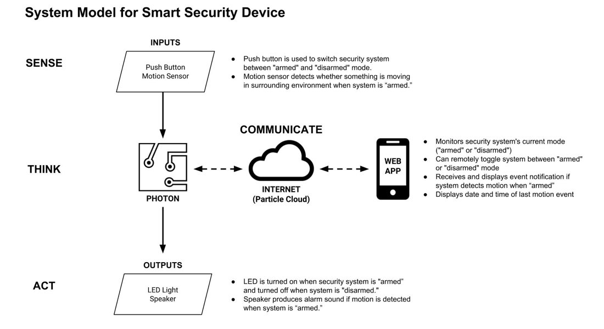

# 2.1 System Model



Similar to robotic devices, IoT devices follow a "sense-think-act" cycle to interact with the physical world. IoT devices also "communicate" through an internet or network connection.

* **SENSE:**  IoT devices typically have one or more **physical inputs** \(such as sensors, etc.\) that gather data from the physical environment.
* **THINK:**  IoT devices are programmed to analyze data from their inputs to make decisions and respond to certain conditions by acting through their outputs.
* **ACT:**  IoT devices typically have one or more **physical outputs** \(such as motors, etc.\) that can do something in the physical environment.
* **COMMUNICATE:**  IoT devices send and/or receive data by communicating with apps, databases, or other devices through an **internet or network connection** \(which is often a wireless signal such as cellular, Wi-Fi, Bluetooth, etc.\). This data communication can serve as a digital input \("sense"\) or as a digital output \("act"\).

### **❏ Deliverable**

Submit your team's system model for your smart device.








| **✓- Below Standard** | **✓ Meets Standard** | **✓+ Exceeds Standard** |
| :--- | :--- | :--- |
| Description | Description | Description |



