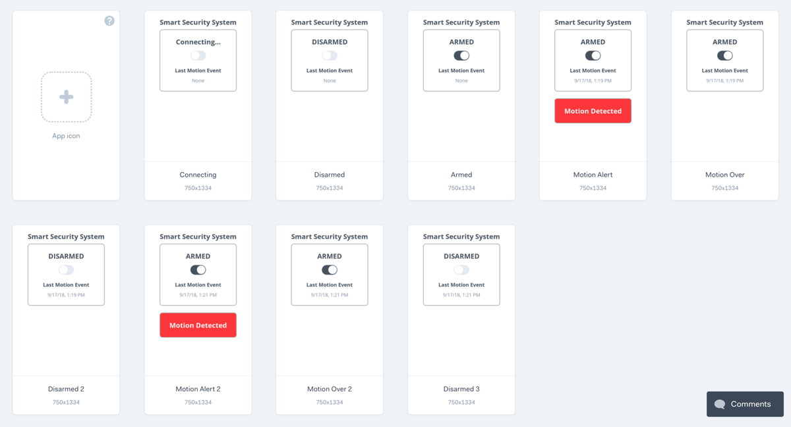

# 2.2 Interactive Prototype



Your team will create an interactive prototype of the web app for your smart device. However, this prototype will **not** be coded \(yet\). Instead, you will first take your interaction storyboard sketches and use them to help create an interactive prototype of screen images.

1. Review your interaction storyboard sketches, and determine if there are any changes that should be made to your smart device's web app. The web app should have at least one primary task. However, determine if any additional tasks or features should be included.
2. Use an online prototyping tool \(such as [Marvel](https://marvelapp.com/), [InVision](https://www.invisionapp.com/), etc.\) to create a sequence of screen images for the web app that will demonstrate/simulate how someone would interact with the web app. You can either import images of your sketched screens, or you can create high-fidelity screen layouts directly in the prototyping tool \(which will also allow you to easily copy and modify screens\).
3. Add one or more clickable "hotspots" to each screen where a user could click a button, link, icon, etc. to perform an action or navigate to another screen. Then link each hotspot to another screen image that shows the result of the interaction.

In the next assignment, you'll test the interactive prototype of your web app with people outside your team to make sure the design of the web app is easy to understand and use. After you've identified possible improvements to web app design, you'll begin to code a functional version of the web app using HTML, CSS, and JS.


**FOCUS ON PRIMARY TASKS:**  Early in the design process, the tasks and features you include in an interactive prototype should be **primary** tasks that are core to the purpose of your solution. Do **NOT** select secondary tasks such as: creating an account, logging into the app, adjusting profile settings, etc.  Secondary tasks should only be prototyped after you have already designed and tested the primary tasks.


### **❏ Deliverable**

Submit a link to the interactive prototype for your team's smart device web app.



**Click on the interactive prototype shown below to start interacting with it.** Once you "arm" the security system, it will simulate a "motion" event after 5 seconds.  A second simulated motion event will occur after several more seconds.

This prototype demonstrates/simulates the following tasks and features:

* Monitor security system's current mode \("armed" or "disarmed"\)
* Can remotely toggle system between "armed" or "disarmed" mode
* Receive and display event notification if system detects motion when “armed”
* Display date and time of last motion event

{% embed data="{\"url\":\"https://marvelapp.com/efi0d09\",\"type\":\"video\",\"title\":\"Smart Security\",\"description\":\"Marvel Prototype for Smart Security\",\"thumbnail\":{\"type\":\"thumbnail\",\"url\":\"https://marvel-live.freetls.fastly.net/serve/2018/9/2801dec328464f7b8c5292ccff26ee2d.png?quality=95&fake=.png\",\"width\":750,\"height\":1334,\"aspectRatio\":1.7786666666666666},\"embed\":{\"type\":\"player\",\"url\":\"https://marvelapp.com/efi0d09?emb=1&\",\"html\":\"

<iframe src=\\\"https://marvelapp.com/efi0d09?emb=1&amp;\\\" style=\\\"border: 0; top: 0; left: 0; width: 100%; height: 100%; position: absolute;\\\" allowfullscreen scrolling=\\\"no\\\"></iframe>

\",\"aspectRatio\":0.4886}}" %}

This interactive prototype was created using a sequence of 9 screen images. Each new screen was created from a copy of a previous screen. Each copied screen was then modified to show the differences in the new screen image.





| **✓- Below Standard** | **✓ Meets Standard** | **✓+ Exceeds Standard** |
| :--- | :--- | :--- |
| Description | Description | Description |



