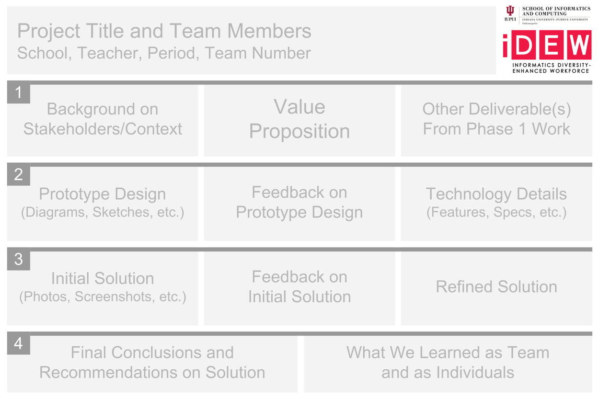

# 3.3 Project Poster



Your team will create a **poster** that helps show how your team researched, designed, prototyped, and evaluated your smart device solution for your targeted problem.

The poster will be a visual reference to supplement the explanation and demonstration that your team gives during the public presentation event. Even though a poster won't show and explain everything about your team's project, a person should be able to understand the key aspects of your team's project just by reviewing your poster.

The goal is for the poster to be clear, concise, engaging, and professional in terms of its content and visual design.

The standard size for a large poster is 36 inches wide by 24 inches tall \(your teacher will clarify if a different poster size will be used\). Your teacher will assist with having the posters printed prior to the public presentation.

1. Determine the content to be included on the poster. Gather text and images from your team's previous project deliverables.  For example, your content might include:  persona, value proposition, design requirements, interaction storyboard sketches, system model, screenshots of interactive prototype, photo of smart device, screenshots of web app, features and tech specs of smart device solution, summary of evaluation findings, etc.
2. Determine the layout of the content by sketching a small-scale poster mockup on a regular sheet of paper.
3. Create a full-scale digital version of the poster using a drawing/illustration tool, such as Google Drawing, Pixlr Editor, Adobe Illustrator, etc.
   1. This [Google Drawing template](https://drive.google.com/open?id=1L81WNIn5YMEQ9TlcliLTdiCO-KwnzWIsXBGnqdumzzo) is set to 36 inches wide by 24 inches tall. Zoom in or out as needed to add text, images, etc. – but do **not** change the canvas size.
   2. If you use a different drawing/illustration tool, set the canvas size to 36 inches wide by 24 inches tall at 300 pixels per inch \(10800 pixels wide by 7200 pixels tall\).
4. Save or download the final poster as a PDF file.

### **❏ Deliverable**

Submit a PDF of your team's poster for printing



This shows a generic layout for the typical content that would be included in a project poster. However, you can modify the layout and appearance as necessary.





| **✓- Below Standard** | **✓ Meets Standard** | **✓+ Exceeds Standard** |
| :--- | :--- | :--- |
| Description | Description | Description |



