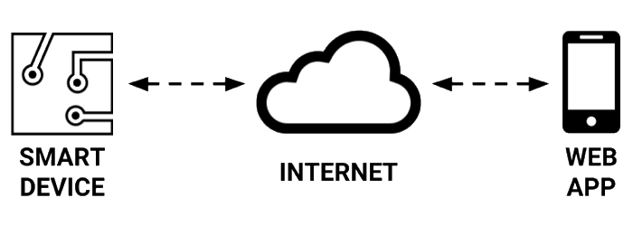

# Project Challenge


**UPDATE IN PROGRESS:** This project guidebook is undergoing a major update to replace the [old version](https://docs.idew.org/internet-of-things-project/). Please check back later. _Notice posted: June 5, 2018_




Each team must design and build an IoT device \(aka "smart device"\) that performs a useful task within a specific context \(such as home, school, business, etc.\). Your team must also design and code a companion web app that interacts with your smart device by sending and receiving data over the internet.

## Smart Device Built Using IoT Electronics Kit

Your team will build a functional prototype of your smart device using an IoT electronics kit, which contains a microcomputer with Wi-Fi capability, along with various physical inputs and outputs that can be connected. Your smart device will need to use **at least one physical input** \(such as sensor, button, etc.\) and **at least one physical output** \(such as motor, light, etc.\).

The provided IoT kit has a limited number of parts, so here are some recommendations:

* **Creative thinking and innovation will be required** to identify possible ways to use each part, as well as possible ways to combine parts. For example, how many different ways can you think of to use a light sensor? What other inputs or outputs could be combined with a light sensor to perform some kind of task?
* Your smart device prototype might have to be a **smaller-scale model or a limited version** of your intended product. For example, a smart security system prototype would most likely be a smaller-scale model of what would actually be installed in a home or building and might feature a limited number of sensors.
* If necessary, **you can simulate certain parts or actions** as long as the main task of your device can still be demonstrated. For example, a smart thermostat prototype could use red and blue LED lights to simulate heating and cooling systems that are turned on and off by the device based on readings from its temperature sensor.
* If necessary, **you can construct parts** \(using cardboard, 3D-printing, etc.\). The constructed parts could provide _functional value_ by helping the device perform its task and/or provide _aesthetic value_ by adding to the device's appearance for demonstration purposes.

## Device App and Web App

Your team will need to design and program two apps that interact with each other: an app that runs on the smart device and a web app that runs in a browser.

The **device app** will gather and process data from the device’s inputs and respond automatically through the device’s outputs based on certain conditions.

The **web app** will interact with the device app by sending and receiving data through the internet. For example, the web app could be used to:

* display data from the smart device
* receive a notification from the smart device
* change the smart device’s settings
* send a command to the smart device
* turn the smart device on or off
* etc.

## Website, Video, Poster, and Presentation

Each team will create a **product marketing website** for their smart device. The website should include a **product demo video**.

At the end of the semester, all teams will demonstrate and explain their smart devices and apps at a **public poster presentation**.



Each phase of the project has a set of team deliverables, but they lead to these final deliverables from each team:

* **Smart Device** built and programmed to be a functional prototype of your solution design
* **Web App** that interacts with smart device by sending and receiving data through internet
* **Product Website** that explains your solution and includes a product demo video
* **Project Poster** that shows how your solution was created and highlights key features
* **Public Presentation** that demonstrates your solution and explains how it was created



Each team's smart device prototype must meet these design criteria:

* **Innovative:** your solution should be unique \(or an improvement over existing solutions\)
* **Feasible:** your solution should be possible to prototype with the given materials/resources
* **Useful:** your solution should fulfill a need, solve a problem, or improve an existing situation
* **Usable:** your solution should be easy to understand and efficient to use
* **Valuable:** your solution should be desirable and valuable to users/stakeholders



Each team's smart device prototype is subject to these constraints:

* Smart device prototype built using sensors and other parts in provided IoT electronics kit​
* Smart device prototype may have to be a smaller-scale model of actual product
* Smart device prototype may have to simulate certain parts or actions \(e.g., smart thermostat could control red and blue LEDs that represent heating and cooling systems\)
* Smart device prototype can include constructed parts \(e.g., cardboard, 3D-printed, etc.\) that provide functional and/or aesthetic value



Each team will have 2-4 members that serve in one or more of these roles:

* **Design Lead:** leads interaction design and evaluation of product
* **Development Lead:** leads building and programming of product
* **Business Lead:** leads business analysis and marketing of product
* **Project Manager:** leads team to ensure project completed successfully

**Teams of 2** need to designate one person as the Design Lead and the other person as the Development Lead. The Design Lead will also serve as the Business Lead, while the Development Lead will also serve as the Project Manager.

**Teams of 3** need to designate different people as the Design Lead, the Development Lead, and the Business Lead. One person will also need to serve as the Project Manager.

**Teams of 4** need to designate different people for each role.



